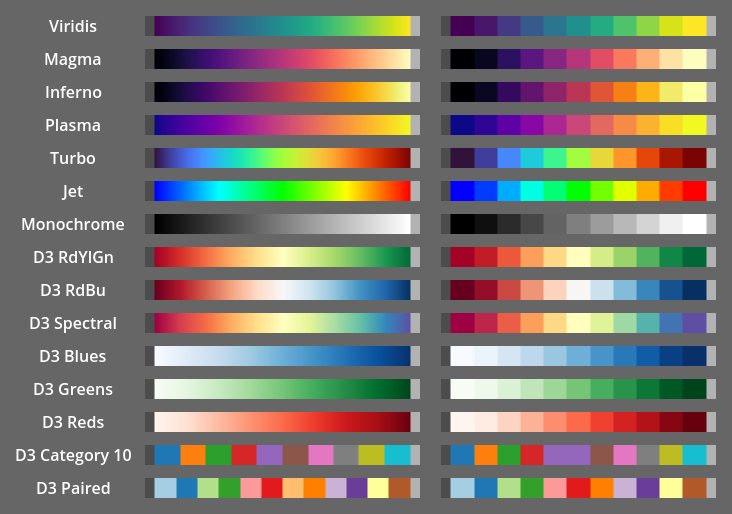

# Color Maps for Godot

This addon provides a number of color maps for data visualization or any other purpose,
with the option of easily creating custom color maps.

## Usage

Create an instance of any provided or custom `ColorMap`, use the `get_color(normalized_value)` function
to get the color corresponding to the value, in a 0-1 range. If you do not want to normalize the value,
you can pass the result of `get_normalized_value(value, min_value, max_value)` instead.

## Examples

The following image shows some of the provided color maps, drawn as 20-pixel wide lines with a pixel
for each value horizontally, as well as 11 color bands.

